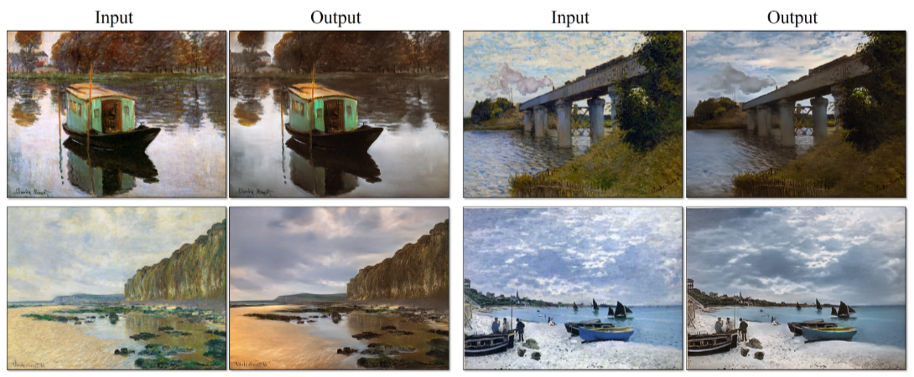

# CycleGAN
Using CycleGAN to convert Monet paintings to Photos and vice versa 
 
**Dataset** is available here: https://people.eecs.berkeley.edu/~taesung_park/CycleGAN/datasets/

 
 

**CycleGAN Paper:** https://arxiv.org/pdf/1703.10593.pdf

# Zombify 

Trained CycleGAN to convert a human image to a zombie image and deployed it. 

 
